# Sistema de Autenticação Sincronizado - FinTransfer

## 🎯 Resumo da Implementação

Este sistema integra completamente a autenticação JWT do backend Spring Boot com o frontend Vue.js, proporcionando uma experiência de usuário fluida e sincronizada.

## 🔧 Arquitetura da Solução

### 1. **Backend (Spring Boot + JWT)**

- **AuthController**: Endpoints `/api/auth/signin` e `/api/auth/signup`
- **JwtUtil**: Geração e validação de tokens JWT com expiração de 24h
- **Spring Security**: Configuração com filtros JWT
- **H2 Database**: Armazenamento de usuários em memória

### 2. **Frontend (Vue.js + Composition API)**

- **useAuth.js**: Composable para gerenciamento global de estado
- **auth.js**: Service melhorado com validação de token e interceptors
- **Navbar**: Componente reativo que mostra estado de autenticação
- **Router Guards**: Proteção de rotas baseada em autenticação

## 📋 Funcionalidades Implementadas

### ✅ **Autenticação Completa**

- [x] Login com JWT
- [x] Registro de usuários
- [x] Logout automático
- [x] Validação de token em tempo real
- [x] Redirecionamento automático quando token expira

### ✅ **Interface Reativa**

- [x] Navbar que atualiza automaticamente
- [x] Estado global sincronizado
- [x] Multi-tab support (sincronização entre abas)
- [x] Feedback visual de loading e erros

### ✅ **Segurança**

- [x] Tokens JWT com expiração
- [x] Interceptors axios para headers automáticos
- [x] Logout automático em caso de 401
- [x] Proteção de rotas sensíveis

## 🔄 Fluxo de Autenticação

```mermaid
graph TD
    A[Usuário acessa /] --> B{Está autenticado?}
    B -->|Não| C[Redirecionar para /signin]
    B -->|Sim| D[Mostrar página Home]
    C --> E[Fazer login]
    E --> F[Backend valida credenciais]
    F --> G[Retorna JWT token]
    G --> H[Salvar token no localStorage]
    H --> I[Atualizar estado global]
    I --> J[Navbar mostra usuário logado]
    J --> D
```



## 🎨 Componentes Principais

### **useAuth Composable**

```javascript
const { isAuthenticated, user, login, register, logout } = useAuth();
```

### **Navbar Inteligente**

- Mostra "Sign In" / "Sign Up" quando deslogado
- Mostra "Welcome back, [username]!" / "Logout" quando logado
- Design responsivo com menu hamburger mobile

### **Router Guards**

- Proteção automática de rotas que requerem autenticação
- Redirecionamento de usuários logados das páginas de login/registro

## 🛠 Estrutura de Arquivos

```
frontend/
├── src/
│   ├── components/
│   │   └── Navbar.vue          # Navbar reativa
│   ├── services/
│   │   ├── auth.js             # Service de autenticação
│   │   └── useAuth.js          # Composable global
│   ├── views/
│   │   ├── SignIn.vue          # Página de login
│   │   ├── SignUp.vue          # Página de registro
│   │   └── Home.vue            # Página principal
│   ├── router/
│   │   └── index.js            # Router com guards
│   └── App.vue                 # App principal
```

## 🚀 Como Usar

### **1. Iniciar os Serviços**

```bash
# Backend (Terminal 1)
cd backend && mvn spring-boot:run

# Frontend (Terminal 2)
cd frontend && npm run dev
```

### **2. Acessar a Aplicação**

- Frontend: http://localhost:5173
- Backend: http://localhost:8080

### **3. Testar Funcionalidades**

1. Acesse http://localhost:5173
2. Será redirecionado para `/signin`
3. Crie uma conta em "Sign Up"
4. Faça login
5. Observe a navbar mudando automaticamente
6. Teste logout e multi-tab sync

## 🔒 Recursos de Segurança

- **Token Expiration**: Tokens expiram em 24h
- **Auto Logout**: Logout automático quando token expira
- **Route Protection**: Rotas protegidas por guards
- **Request Interceptors**: Headers JWT automáticos
- **Error Handling**: Tratamento de erros 401/403

## 📱 Responsividade

- Design mobile-first
- Menu hamburger para dispositivos móveis
- Transições suaves
- Interface adaptável

## ✨ Melhorias Implementadas

1. **Estado Global Reativo**: useAuth composable
2. **Validação de Token**: Verificação de expiração
3. **Multi-tab Support**: Sincronização entre abas
4. **UX Aprimorada**: Feedback visual e transições
5. **Código Limpo**: Separação de responsabilidades

O sistema está completamente funcional e pronto para uso! 🎉
